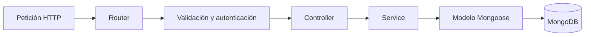

# Documentación de la migración de LinkVault a TypeScript

## 1. Resumen ejecutivo

El backend de LinkVault fue migrado completamente de JavaScript a TypeScript. La migración se realizó sobre la arquitectura por capas introducida previamente en la rama `codex/backend-architecture-refactor` y se desarrolló en la rama independiente `codex/typescript-migration`.

El objetivo no fue solamente cambiar extensiones de `.js` a `.ts`. Se incorporó tipado estricto en los límites más importantes del sistema: variables de entorno, peticiones HTTP, autenticación, modelos de MongoDB, filtros de consulta, paginación, servicios, errores y respuestas. También se agregó un proceso de compilación reproducible para generar el JavaScript que se ejecutará en producción.

La API conserva las rutas y el comportamiento funcional del backend refactorizado. La migración no cambia intencionalmente los contratos HTTP, la colección de MongoDB ni la estrategia de autenticación JWT.

## 2. Estado de la migración

| Elemento | Estado |
|---|---|
| Archivos de producción migrados a `.ts` | Completado |
| Pruebas migradas a `.ts` | Completado |
| Configuración estricta de TypeScript | Completado |
| Compilación hacia `dist/` | Completado |
| Chequeo de tipos | Completado |
| Pruebas unitarias | 5 aprobadas, 0 fallidas |
| Auditoría de dependencias de producción | 0 vulnerabilidades conocidas |
| Carga básica del módulo compilado | Completada |
| Pruebas contra MongoDB real | Pendientes de un entorno con credenciales válidas |
| Rotación de la credencial MongoDB expuesta anteriormente | Acción manual obligatoria |

## 3. Motivo de la migración

La versión JavaScript permitía que ciertos errores llegaran hasta la ejecución. Un ejemplo real era la diferencia entre propiedades como `Title` y `title`. JavaScript acepta ambas expresiones, aunque solamente una coincide con el modelo de datos. TypeScript convierte ese tipo de equivocación en un error detectable durante el desarrollo.

La migración aporta principalmente:

- Contratos explícitos para usuarios, roles, bookmarks y datos paginados.
- Detección anticipada de valores `undefined` o estructuras incompletas.
- Autocompletado y navegación segura entre capas.
- Firmas claras para funciones asíncronas.
- Refactorizaciones con menor riesgo.
- Tipado de Mongoose, Express, JWT, Joi y middleware.
- Un artefacto compilado estable para producción.
- Separación entre herramientas de desarrollo y dependencias ejecutadas en producción.

## 4. Alcance

Se migraron las siguientes áreas:

- Inicio y cierre controlado del servidor.
- Configuración y validación de variables de entorno.
- Conexión y desconexión de MongoDB.
- Aplicación Express, CORS, Helmet y Swagger.
- Modelos `User` y `Bookmark`.
- Middleware de autenticación, autorización, validación y errores.
- Controladores de autenticación, usuarios y bookmarks.
- Servicios con la lógica de negocio.
- Esquemas Joi y tipos de sus datos validados.
- Utilidades de tokens, paginación y búsqueda.
- Script de migración de `userID` a `owner`.
- Pruebas unitarias.
- Scripts de desarrollo, prueba, compilación y producción.

No se realizaron los siguientes cambios:

- No se migró MongoDB a otra tecnología.
- No se sustituyó Express.
- No se cambió JWT por sesiones.
- No se modificaron intencionalmente las rutas del API refactorizado.
- No se añadieron refresh tokens.
- No se ejecutó la migración sobre una base de datos real.
- No se reescribió el historial de Git que contiene la credencial antigua.

## 5. Arquitectura resultante

```text
LinkVault/
├── docs/
│   └── TYPESCRIPT_MIGRATION.md
└── BackEnd/
    ├── src/
    │   ├── config/
    │   │   ├── database.ts
    │   │   └── env.ts
    │   ├── controllers/
    │   │   ├── authController.ts
    │   │   ├── bookmarkController.ts
    │   │   └── userController.ts
    │   ├── docs/
    │   │   └── swagger.ts
    │   ├── middlewares/
    │   │   ├── authenticate.ts
    │   │   ├── authorize.ts
    │   │   ├── errorHandler.ts
    │   │   ├── notFound.ts
    │   │   └── validate.ts
    │   ├── models/
    │   │   ├── Bookmark.ts
    │   │   └── User.ts
    │   ├── routes/
    │   │   ├── authRoutes.ts
    │   │   ├── bookmarkRoutes.ts
    │   │   ├── index.ts
    │   │   └── userRoutes.ts
    │   ├── scripts/
    │   │   └── migrateBookmarkOwners.ts
    │   ├── services/
    │   │   ├── authService.ts
    │   │   ├── bookmarkService.ts
    │   │   └── userService.ts
    │   ├── types/
    │   │   ├── express.d.ts
    │   │   └── http.ts
    │   ├── utils/
    │   │   ├── AppError.ts
    │   │   ├── asyncHandler.ts
    │   │   ├── bookmarkFilter.ts
    │   │   ├── pagination.ts
    │   │   └── token.ts
    │   ├── validators/
    │   │   ├── authSchemas.ts
    │   │   ├── bookmarkSchemas.ts
    │   │   ├── common.ts
    │   │   └── userSchemas.ts
    │   ├── app.ts
    │   └── server.ts
    ├── test/
    │   ├── bookmarkFilter.test.ts
    │   └── pagination.test.ts
    ├── .env.example
    ├── package.json
    ├── package-lock.json
    ├── tsconfig.json
    └── tsconfig.build.json
```

El flujo principal permanece organizado de la siguiente manera:



## 6. Decisiones técnicas

### 6.1 TypeScript estricto

Se activó `strict: true`. Esto habilita un conjunto de controles que evita asumir que un valor existe o que tiene determinada forma sin demostrarlo previamente.

También se activaron opciones adicionales:

| Opción | Propósito |
|---|---|
| `noUncheckedIndexedAccess` | Considera que el acceso mediante índice podría devolver `undefined`. |
| `exactOptionalPropertyTypes` | Distingue entre una propiedad ausente y una propiedad presente con valor `undefined`. |
| `noImplicitOverride` | Obliga a declarar explícitamente métodos que sobrescriben otros métodos. |
| `noUnusedLocals` | Detecta variables o importaciones sin utilizar. |
| `noUnusedParameters` | Detecta parámetros innecesarios. |
| `useUnknownInCatchVariables` | Trata errores capturados como `unknown` hasta comprobar su tipo. |
| `forceConsistentCasingInFileNames` | Evita diferencias de mayúsculas entre Windows y Linux. |
| `skipLibCheck` | Evita que tipos internos de dependencias ralenticen o bloqueen la compilación. |

### 6.2 Dos configuraciones de TypeScript

`tsconfig.json` se utiliza para revisar tanto el código de producción como las pruebas. No genera archivos cuando se ejecuta mediante `npm run typecheck`.

`tsconfig.build.json` extiende la configuración principal, compila solamente `src/` y deposita el resultado en `dist/`. Esto evita incluir pruebas dentro del artefacto de producción.

### 6.3 CommonJS como salida

El proyecto mantiene `"type": "commonjs"` para conservar compatibilidad con el comportamiento anterior y con las dependencias actuales. TypeScript utiliza `module` y `moduleResolution` en modo `NodeNext`, permitiendo trabajar con sintaxis moderna de `import` y `export`, mientras produce módulos compatibles con Node.js.

### 6.4 Node.js 24 como versión mínima

La versión mínima fue alineada con `@types/node` y con el entorno utilizado para validar la migración. Esto reduce la posibilidad de compilar utilizando APIs que no existan en el runtime de producción.

## 7. Dependencias incorporadas

Las herramientas de TypeScript se añadieron como `devDependencies`, porque son necesarias para desarrollar, comprobar y compilar, pero no para ejecutar el JavaScript ya compilado.

| Dependencia | Uso |
|---|---|
| `typescript` | Compilador y sistema de tipos. |
| `tsx` | Ejecución de archivos TypeScript durante desarrollo, pruebas y migraciones. |
| `@types/node` | Tipos para Node.js. |
| `@types/express` | Tipos para Express 5. |
| `@types/cors` | Tipos para CORS. |
| `@types/bcrypt` | Tipos para cifrado y comparación de contraseñas. |
| `@types/jsonwebtoken` | Tipos para firma y validación de JWT. |
| `@types/swagger-jsdoc` | Tipos para generación de OpenAPI. |
| `@types/swagger-ui-express` | Tipos para la interfaz Swagger. |

Mongoose, Joi, Helmet y Dotenv ya proporcionan sus propios tipos, por lo que no necesitan paquetes `@types` separados.

## 8. Tipos de dominio

### 8.1 Usuarios

`models/User.ts` ahora define:

- `UserRole`: unión literal `"user" | "admin"`.
- `IUser`: estructura persistida del usuario.
- `UserDocument`: documento hidratado de Mongoose.

El rol deja de ser un texto arbitrario para el compilador. Una función que acepte `UserRole` rechazará valores como `administrator`, `superuser` o errores de escritura.

### 8.2 Bookmarks

`models/Bookmark.ts` define `IBookmark` y `BookmarkDocument`. Las propiedades `owner`, `tags`, fechas y contenido quedan tipadas tanto en el esquema de Mongoose como en los servicios que las consumen.

El propietario utiliza `Types.ObjectId`, evitando mezclar accidentalmente identificadores de MongoDB con objetos completos o datos de otro tipo.

### 8.3 Resultados paginados

`utils/pagination.ts` incorpora tipos genéricos reutilizables:

- `PaginationInput`.
- `Pagination`.
- `PaginationMetadata`.
- `PaginatedResult<T>`.

El mismo contrato es utilizado para usuarios y bookmarks. Esto evita duplicar estructuras y garantiza que todas las listas paginadas tengan `page`, `limit`, `total` y `pages`.

## 9. Tipado de peticiones HTTP

Los datos recibidos desde internet no se consideran seguros solamente porque TypeScript declare una interfaz. TypeScript desaparece después de compilar y no valida JSON en tiempo de ejecución. Por esa razón se conservó Joi.

El flujo aplicado es:

1. Express recibe datos sin confianza.
2. El middleware `validate.ts` los compara con un esquema Joi.
3. Joi elimina propiedades desconocidas mediante `stripUnknown`.
4. Los datos validados se almacenan en `req.validated`.
5. El controlador obtiene esos datos mediante `getValidated<Body, Params, Query>()`.
6. El servicio recibe interfaces concretas, no el objeto `Request` completo.

`types/express.d.ts` amplía el tipo oficial de `Express.Request` para incluir:

- `id`: identificador de trazabilidad de la petición.
- `user`: usuario autenticado, cuando corresponde.
- `validated`: cuerpo, parámetros y query validados.

`types/http.ts` concentra las funciones que comprueban que el usuario y los datos validados estén disponibles. Esto elimina el uso indiscriminado del operador `!` y conserva una respuesta controlada si el orden del middleware se configura incorrectamente.

## 10. Autenticación y autorización

El middleware de autenticación ahora verifica explícitamente que:

- Exista el encabezado `Authorization`.
- Utilice el formato `Bearer`.
- El token no esté vacío.
- El resultado de `jwt.verify` sea un objeto.
- El claim `sub` sea un texto válido.
- El usuario todavía exista en MongoDB.

El objeto autenticado se adjunta a la petición como `UserDocument`. Los controladores no aceptan un identificador suministrado por el cliente para decidir la propiedad de un bookmark; utilizan el `_id` del usuario autenticado.

La autorización administrativa utiliza `UserRole`. Solamente el valor literal `admin` puede acceder a las rutas administrativas.

## 11. Servicios y separación de responsabilidades

Los controladores se limitan a:

- Obtener datos validados.
- Obtener el usuario autenticado.
- Llamar al servicio correspondiente.
- Elegir el código HTTP y construir la respuesta.

Los servicios contienen:

- Reglas de negocio.
- Consultas de Mongoose.
- Verificación de propiedad.
- Paginación.
- Prevención de autoeliminación o cambio del propio rol administrativo.

Esta separación permite probar las reglas sin simular todo Express y evita que los detalles HTTP se propaguen hasta la capa de datos.

## 12. Errores

`AppError.ts` representa errores operacionales conocidos, incluyendo código HTTP, mensaje y detalles opcionales.

`errorHandler.ts` recibe valores `unknown`. Antes de leer propiedades, comprueba si el error es:

- Una instancia de `AppError`.
- Un error de conversión de Mongoose.
- Un error de índice único de MongoDB.
- Un error interno no reconocido.

Los errores internos devuelven un mensaje genérico al cliente y se registran en el servidor junto al `requestId`. El stack solamente se incluye en respuestas cuando `NODE_ENV=development`.

## 13. Variables de entorno

`config/env.ts` expone un objeto `AppConfig` de solo lectura. El proceso se detiene temprano si falta `MONGODB_URI`, si falta `JWT_SECRET`, si el secreto tiene menos de 32 caracteres o si `PORT` no es válido.

Variables disponibles:

| Variable | Obligatoria | Ejemplo seguro |
|---|---:|---|
| `NODE_ENV` | No | `development` |
| `PORT` | No | `3000` |
| `MONGODB_URI` | Sí | `mongodb://127.0.0.1:27017/linkvault` |
| `JWT_SECRET` | Sí | Cadena aleatoria de 32 caracteres o más |
| `JWT_EXPIRES_IN` | No | `1h` |
| `CORS_ORIGIN` | No | `http://localhost:5173` |

Para permitir varios orígenes CORS, se pueden separar mediante comas.

## 14. Comandos disponibles

| Comando | Descripción |
|---|---|
| `npm run dev` | Ejecuta `src/server.ts` y reinicia ante cambios. |
| `npm run typecheck` | Revisa tipos sin generar JavaScript. |
| `npm test` | Ejecuta pruebas TypeScript con el runner de Node y el loader de `tsx`. |
| `npm run clean` | Elimina de forma segura el directorio compilado `dist/`. |
| `npm run build` | Compila `src/` hacia `dist/`. |
| `npm run check` | Ejecuta typecheck, pruebas y build en secuencia. |
| `npm start` | Ejecuta `dist/server.js`. Requiere haber compilado primero. |
| `npm run migrate:bookmarks` | Migra documentos antiguos de `userID` a `owner`. |

## 15. Resultado de validación

La migración fue validada con:

```bash
npm run check
```

Resultado obtenido:

- TypeScript `strict`: aprobado.
- Pruebas: 5 aprobadas, 0 fallidas.
- Build de producción: aprobado.
- Carga del módulo compilado `dist/app.js`: aprobada.
- `npm audit --omit=dev`: 0 vulnerabilidades conocidas.

También se eliminaron las dependencias directas `nodemon` y `mongodb`: `tsx` reemplaza a Nodemon en desarrollo y Mongoose ya administra internamente el cliente de MongoDB utilizado por la aplicación.

Las pruebas actuales cubren paginación y construcción segura de filtros de búsqueda. Todavía deben añadirse pruebas de integración con una base temporal para cubrir registro, login, permisos administrativos, propiedad de bookmarks y manejo de duplicados.

## 16. Compatibilidad del API

La migración conserva estos endpoints:

- `POST /api/v1/auth/register`
- `POST /api/v1/auth/login`
- `GET /api/v1/auth/me`
- `GET /api/v1/bookmarks`
- `POST /api/v1/bookmarks`
- `GET /api/v1/bookmarks/:id`
- `PATCH /api/v1/bookmarks/:id`
- `DELETE /api/v1/bookmarks/:id`
- `GET /api/v1/users`
- `PATCH /api/v1/users/:id/role`
- `DELETE /api/v1/users/:id`
- `GET /api/v1/health`

No es necesario que un futuro frontend utilice TypeScript para consumirlos. El frontend seguirá enviando y recibiendo JSON normal.

## 17. Migración de la base de datos existente

La versión antigua guardaba el propietario en `userID`; la arquitectura nueva utiliza `owner`. TypeScript no cambia automáticamente documentos existentes.

Procedimiento recomendado:

1. Crear un backup de MongoDB.
2. Configurar un `.env` con la base correcta.
3. Ejecutar `npm run migrate:bookmarks` una sola vez.
4. Verificar cuántos documentos fueron modificados.
5. Iniciar el backend y probar el listado de bookmarks con un usuario real.

El script solamente modifica documentos que tengan `userID` y no tengan todavía `owner`, por lo que es seguro volver a ejecutarlo: los documentos ya migrados no coinciden con el filtro.

## 18. Instalación y ejecución

```bash
cd BackEnd
npm ci
cp .env.example .env
# Editar .env con valores reales y seguros
npm run check
npm run build
npm start
```

En producción se recomienda instalar solamente dependencias de ejecución después de construir el proyecto en una etapa separada:

```bash
npm ci
npm run check
npm run build
npm prune --omit=dev
NODE_ENV=production npm start
```

`dist/`, `node_modules/` y `.env` están excluidos de Git. El despliegue debe construir `dist/` o recibirlo desde un pipeline de CI.

## 19. Estrategia de despliegue

Antes de fusionar o desplegar:

1. Rotar la contraseña MongoDB anteriormente expuesta.
2. Crear un backup de la base.
3. Configurar secretos en la plataforma de despliegue.
4. Ejecutar `npm ci`.
5. Ejecutar `npm run check`.
6. Ejecutar la migración de bookmarks si aplica.
7. Ejecutar `npm run build`.
8. Iniciar `dist/server.js` mediante `npm start`.
9. Consultar `/api/v1/health`.
10. Probar registro, login y CRUD con un usuario no administrativo.
11. Confirmar que un usuario no pueda consultar ni modificar recursos ajenos.

## 20. Rollback

Si el despliegue falla:

1. Detener la versión TypeScript compilada.
2. Restaurar la versión anterior del artefacto o commit.
3. Mantener la nueva contraseña MongoDB; nunca restaurar la credencial expuesta.
4. La modificación `userID` → `owner` es compatible con el backend nuevo, pero el backend antiguo espera `userID`. Para regresar funcionalmente al backend antiguo sería necesario restaurar el backup o ejecutar una migración inversa controlada.

Por esta razón el backup previo a la migración es obligatorio.

## 21. Riesgos y trabajo pendiente

### Obligatorio antes de producción

- Rotar la credencial de MongoDB Atlas.
- Guardar `JWT_SECRET` en un gestor de secretos.
- Probar contra una base de datos aislada.
- Ejecutar la migración con backup.
- Configurar el origen real del frontend en CORS.

### Próximas mejoras recomendadas

- Pruebas de integración con una base temporal.
- Rate limiting en login y registro.
- Refresh tokens con rotación y revocación.
- Recuperación segura de contraseña.
- Verificación de correo electrónico.
- Logs estructurados con niveles y redacción de datos sensibles.
- Pipeline de GitHub Actions para ejecutar `npm ci` y `npm run check`.
- Análisis de dependencias y actualizaciones automáticas.
- Versionado formal y changelog.

## 22. Lista final de verificación

- [x] Todo el código fuente utiliza `.ts` o `.d.ts`.
- [x] TypeScript está configurado en modo estricto.
- [x] Los modelos de dominio tienen interfaces explícitas.
- [x] Los datos HTTP se validan en tiempo de ejecución.
- [x] El usuario autenticado está tipado.
- [x] Los servicios no dependen directamente de Express.
- [x] Los errores capturados se tratan como `unknown`.
- [x] Las pruebas utilizan TypeScript.
- [x] El build genera `dist/`.
- [x] `dist/` y `node_modules/` están ignorados.
- [x] El lockfile incluye las herramientas incorporadas.
- [ ] Credencial MongoDB rotada por el propietario.
- [ ] Pruebas de integración ejecutadas con MongoDB.
- [ ] Migración aplicada a la base real con backup.
- [ ] Pipeline de CI habilitado.

## 23. Conclusión

LinkVault dispone ahora de una base TypeScript estricta, compilable y preparada para crecer. El cambio más importante no es la extensión de los archivos, sino la creación de contratos verificables entre las capas del sistema. Los errores de estructura, propiedades mal escritas, roles inválidos, payloads JWT inesperados y valores opcionales mal gestionados ahora pueden detectarse antes de ejecutar o desplegar la aplicación.

La migración técnica está completada. Para considerar el backend listo para producción todavía deben completarse la rotación de credenciales, las pruebas con MongoDB real, la migración respaldada de datos y la automatización de CI.
